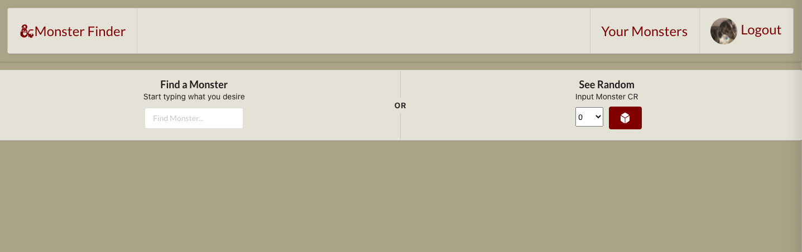
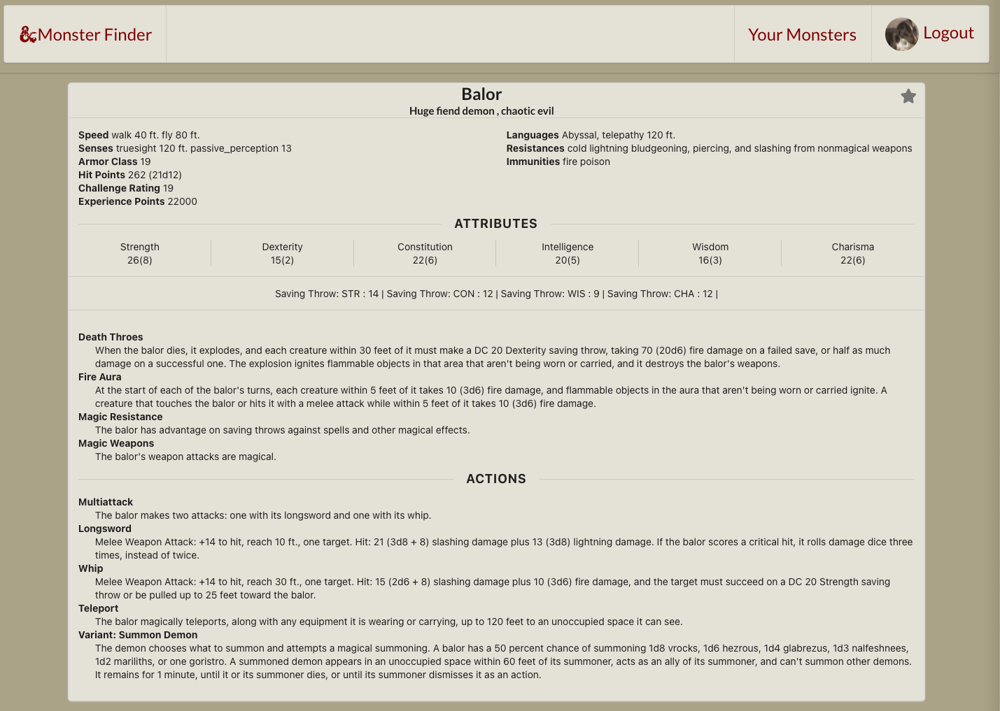
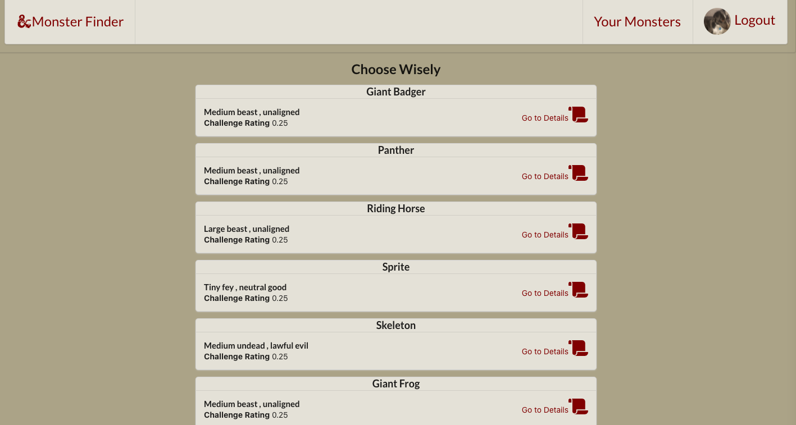
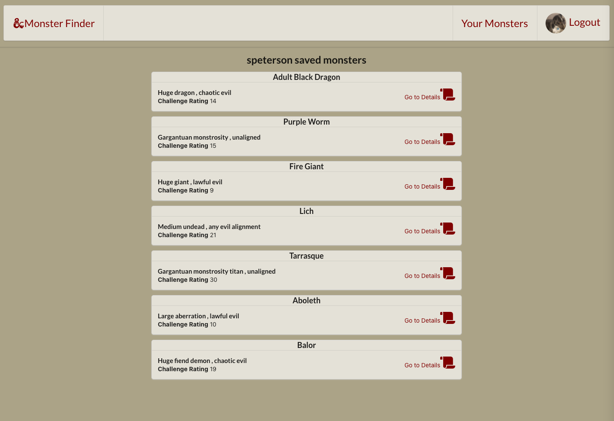

# MonsterFinder

## Table Contents

- [Overview](#overview)
- [Getting Started](#getting-started)
- [Technologies Used](#technologies-used)
- [Screenshots](#screenshots)
- [Development](#development)
  - [Future Additions](#future-additions)

---

---

## Overview

 _MonsterFinder_ is a site where you can query the Dungeons and Dragons 5e Monster Manual for monsters you need for your campaign! Save the monsters to reference later ,use the CR randomizer to help tailor the perfect challenge.

---

## Getting Started

Explore
[MonsterFinder](https://monsterfinder.herokuapp.com/)

---

View the
[Trello](https://trello.com/b/CIxF7p6H/monsterfinder) board with wireframes and ERD.

---

---

## Technologies Used

### MERNStack Application and D&D 5th Edition API

---

## Screenshots

#### Monster Search Page

#### Monster Details Page

#### Random Monster Search by CR

#### Monsters that have been saved for later

---

### _Future Additions_:

- Implement other D20 based games Monster Compendiums (Though it looks like the others don't have the same type of API set up)
- Able to leave notes on favorited monsters
- Ability to use a slider with the Monster CR search.
- Ability to create tags/folders for favorited monsters to save them to specific campaigns.
